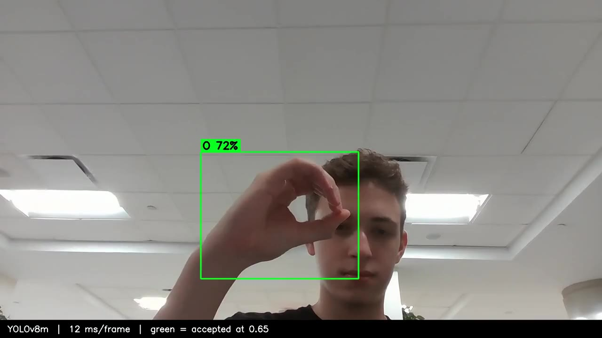

# ASL Arcade

**Built in 36 hours of straight coding at ShellHacks 2024, Florida's largest hackathon.**

A 3D arcade game that teaches the American Sign Language alphabet. The game asks
the player to sign a letter, watches through the webcam, and tells them whether
they got it right. Behind it is a fine-tuned YOLOv8 detector served over HTTP, so
the game itself never has to know anything about machine learning.

[](vision-service/docs/demo.mp4)

*The shipped detector running on webcam footage recorded at the venue. Green means
the service accepted the sign at its 0.65 threshold, amber means it saw something
but was not confident enough to commit. [Watch the clip](vision-service/docs/demo.mp4).*

## How it fits together

```
Unity 3D client                          Python inference service
+---------------------+                  +---------------------------+
| arcade minigames    |                  | Flask                     |
| webcam capture      | --- POST ------> |   POST /detect            |
| "sign the letter A" |   base64 JPEG    |   GET  /health            |
|                     |   + target       |                           |
|                     |                  | YOLOv8m, 26 letter classes|
| correct / try again | <-- JSON ------- | verdict + confidence      |
+---------------------+                  +---------------------------+
```

The client sends one frame and the letter the player was asked for. The service
answers a single question: is the player making this sign right now, and how
confident are we? Keeping the verdict on the server side means the threshold, the
class list, and the model can all change without touching the game.

The inference service is in [`vision-service/`](vision-service/), with its own
[README](vision-service/README.md) covering setup, the API contract, and results.

## What we shipped in 36 hours

- Picked and prepared a 26-class ASL letter dataset.
- Fine-tuned and compared two YOLOv8 backbones, small and medium, on a laptop GPU.
- Stood up the inference service and got the Unity client talking to it live over
  the venue network.
- Built the 3D arcade loop around it.

What we did not do in 36 hours: write tests, handle errors properly, or keep the
repository tidy. That part came later, see below.

## Results, honestly

The shipped model reaches **mAP@50-95 of 0.861** on the held-out validation split
and runs at **12.4 ms per frame, about 80 fps**, on an RTX 4060 Laptop GPU.

On real webcam footage recorded at the venue it is far less certain: at the 0.65
threshold the service used, it commits to an answer on **11.4% of frames**. The
training set has limited signer and background diversity, so the validation
numbers are optimistic about the real world. The game's design absorbs this, since
it only needs one confident detection to accept a sign, not every frame.

Full numbers, curves, and the reasoning are in
[`vision-service/docs/metrics.md`](vision-service/docs/metrics.md).

## Repository history

The first four commits are the hackathon code as it was submitted on 29 September
2024, at their original dates. Everything after them is a later cleanup: the code
was restructured into a package, the hardcoded venue IP and the committed 370 MB
of weights and datasets were removed, tests and documentation were added.

The model and the inference path were not changed. What ran at ShellHacks is what
runs here.

## Team

Built at ShellHacks 2024 by a team of three.

- **Daniel Estrada**, Unity 3D arcade client
- **Franco Silvestri**, ASL detection model and inference service
- **Jorge Mario Álvarez**, team support throughout the event

## Credits

- Dataset: [American Sign Language Letters v1](https://universe.roboflow.com/david-lee-d0rhs/american-sign-language-letters/dataset/1),
  Roboflow Universe, Public Domain.
- Detector: [Ultralytics YOLOv8](https://github.com/ultralytics/ultralytics).
- The original repository was cloned from Mukund Mishra's YOLOv8 sign recognition
  project, which is where the training setup started. None of that code remains
  here: it was replaced during the event and removed before submission.

## License

AGPL-3.0. Ultralytics YOLOv8 and its pretrained weights are AGPL-3.0, and a model
fine-tuned from them inherits that license when distributed, so this repository
matches it. See [LICENSE](LICENSE).
