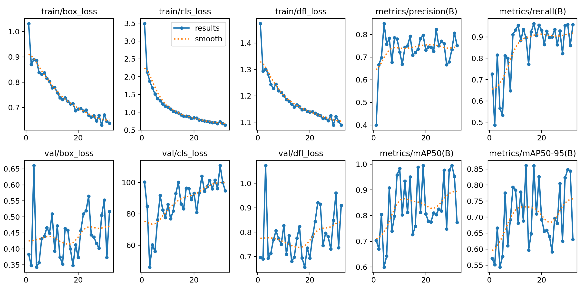
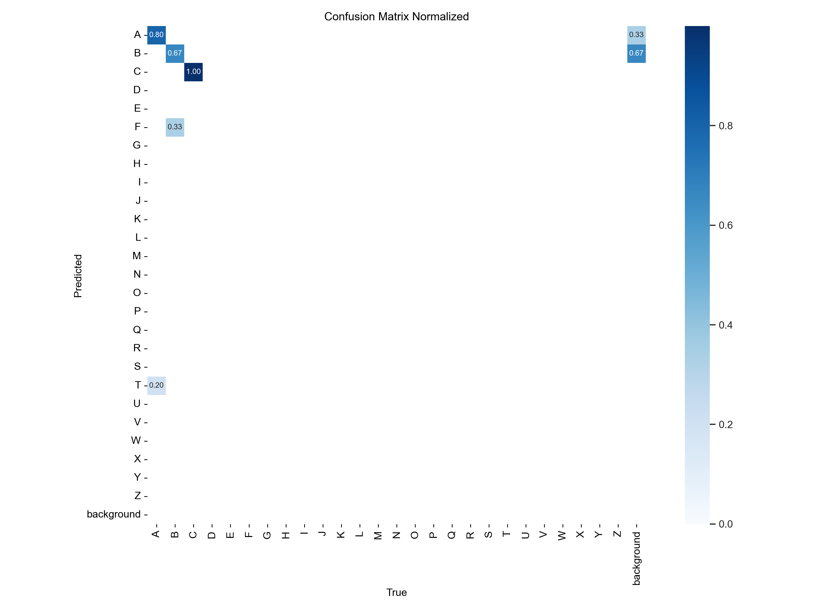
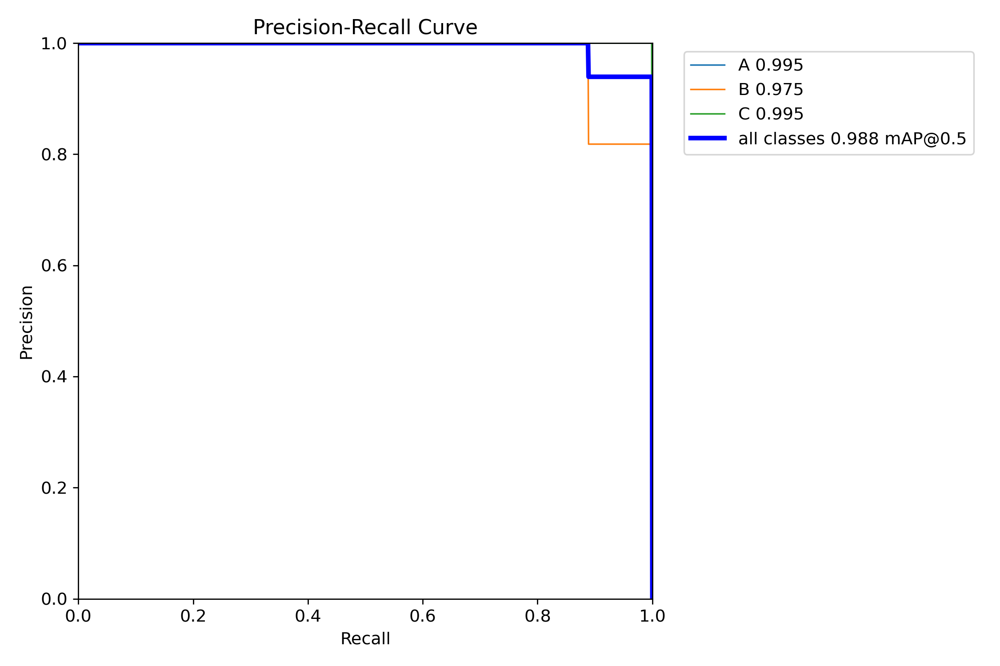
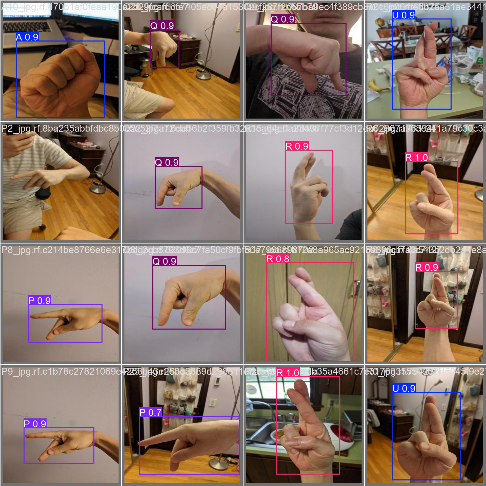

# Training results

Two backbones were fine-tuned on the ASL letters dataset during the event, both
with `seed=0` and `deterministic=true`, 640 px images, batch 16, on a single
RTX 4060 Laptop GPU.

| Run | Backbone | Params | Epochs run | Best mAP@50-95 | mAP@50 at that epoch | Precision | Recall |
|---|---|---|---|---|---|---|---|
| `yolov8s` | YOLOv8s | 11.2 M | 27 (early stop, patience 10) | 0.811 (ep 17) | 0.958 | 0.803 | 0.837 |
| `yolov8m` | YOLOv8m | 25.9 M | 27 (early stop, patience 10) | **0.861 (ep 14)** | 0.951 | 0.792 | 0.896 |

The medium backbone won on mAP@50-95 by 5 points and on recall by 6, at roughly
2.3x the parameters. Latency was not the constraint (see below), so the service
ships the medium model.

The peak mAP@50 numbers are higher than the table shows: 0.995 for the medium
model at epoch 19 and 0.980 for the small one at epoch 24. Those epochs score
worse on mAP@50-95, which is the stricter metric, so they are not the checkpoints
that were selected. Quoting the 0.995 on its own would be misleading.

A third run named `augmented_model` appears in the original repository. It is the
same medium-backbone run relaunched with `patience` raised from 10 to 15. Because
the seed was fixed, its first 27 epochs are identical to the original run
row-for-row, it ran 5 further epochs, and it still selected epoch 14. The two
checkpoints contain byte-identical weight tensors. It is not a third model, and
despite the name nothing about its augmentation differed.

Per-epoch numbers are in [`training-results.csv`](training-results.csv). That file
covers the 32-epoch rerun described above; its first 27 rows are the original
medium-backbone run, identical value for value.

## How well this actually generalises

Read the table above with the dataset in mind. The Roboflow ASL letters set is
small and homogeneous: limited signer diversity, similar framing, similar
backgrounds. A validation mAP measured on a held-out split of that same
distribution is optimistic about a webcam pointed at a stranger in a different
room.

We can put a number on the gap. Running the shipped model over 17 seconds of
webcam footage recorded at the venue, at the 0.65 threshold the service used:

| Metric | Value |
|---|---|
| Mean inference latency | 12.4 ms/frame (1920x1080 input, RTX 4060 Laptop) |
| Median / p95 latency | 12.4 ms / 13.5 ms |
| Throughput | ~80 fps |
| Frames with an accepted detection | 11.4% |

So the detector is fast enough to run well ahead of a 30 fps camera, but on
unseen real-world frames it only commits to an answer about one frame in nine,
and it produces occasional false positives on non-hand objects such as clothing.

That is survivable for this product, and the design accounts for it: the game
does not need every frame classified, it needs one confident detection before it
accepts that the player made the sign. At 30 fps, one frame in nine still means
roughly three accepted detections per second while the sign is held.

Closing the gap properly would mean more signer and environment diversity in the
training data, not more epochs.

